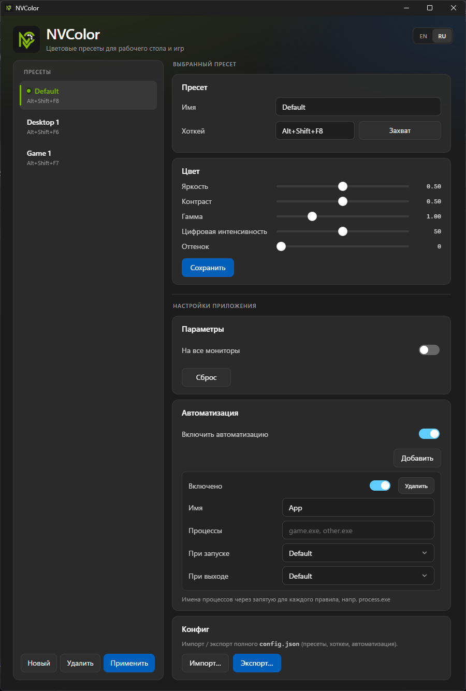

  

<h1 align="center">NVColor</h1>

  Создание и настройка цветовых профилей для Windows: яркость, контраст, гамма, Digital Vibrance и Hue

  

## Скачать

Готовый **`NVColor.exe`** — в [Releases](../../releases)

1. Скачай последний релиз  
2. Положи `NVColor.exe` в любую папку  
3. Запусти  

Рядом с exe при первом запуске появится `config.json` в нем будут находиться сохраненные пресеты

## Возможности

- Создание пресетов настроек и выбор их с использованием горячих клавиш
- Редактирование параметров цвета в реальном времени
- Автовыбор профиля при запуске игры
- Импорт / экспорт конфига
- Сброс настроек при выходе из программы

Пример схемы конфига: [`config.example.json`](config.example.json).

## Требования

- Windows 10 / 11  
- WebView2  
- Для Digital Vibrance / Hue — NVIDIA GPU и драйвер

## Лицензия

MIT

---

English

**NVColor** — Windows tray app for display color presets (brightness / contrast / gamma via Win32, Digital Vibrance & Hue via NVAPI).

Download the portable **`NVColor.exe`** from [Releases](../../releases). Source code is in this repository; end users do not need to build from scripts.

MIT License.

